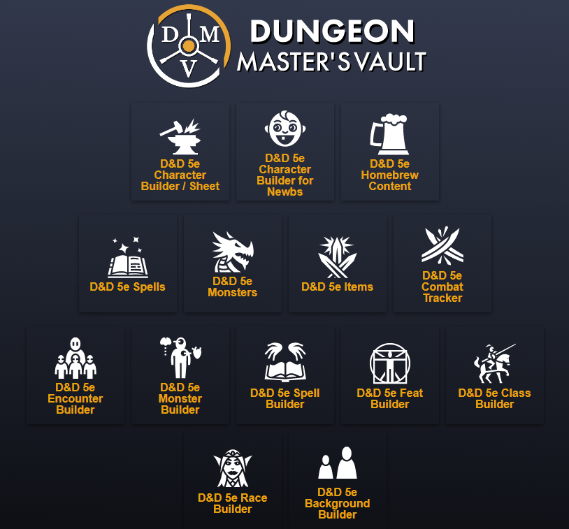

# Dungeon Master's Vault - Community Edition
<div align="center">
    <br>
    
    <br>
</div>

<div align="center">
    <h4>A D&D 5e Character Sheet Generator</h4>

Forked from [OrcPub2](https://github.com/larrychristensen/orcpub) (Jan 2019) with ongoing improvements.

   


 

 

 

[About](#about) | [Quick Start](#quick-start) | [Development](#development) | [Architecture](#architecture) | [Contributing](#contributing) | [FAQ](#faq)

</div>

## About

Dungeon Master's Vault is a full-stack Clojure/ClojureScript web application for generating and managing D&D 5th Edition character sheets. You can host your own instance or contribute to development.

### Stack

| Layer | Technology |
|-------|-----------|
| Runtime | Java 21 (OpenJDK) |
| Backend | Clojure 1.12, Pedestal 0.7, Buddy auth |
| Frontend | ClojureScript, React 18, Reagent 2.0, re-frame |
| Database | Datomic Pro (dev transactor) |
| Build | Leiningen, cljsbuild, figwheel-main |
| Dev environment | VS Code devcontainer (recommended) |

---

## Quick Start

### Development (devcontainer)

The fastest path. Requires [VS Code](https://code.visualstudio.com/) with [Dev Containers](https://marketplace.visualstudio.com/items?itemName=ms-vscode-remote.remote-containers), or [GitHub Codespaces](https://github.com/features/codespaces).

```bash
git clone https://github.com/orcpub/orcpub.git
cd orcpub && code .
# Click "Reopen in Container" when prompted, then:
./scripts/dev-setup.sh     # Install deps, init DB, create test user
./menu                     # Interactive service launcher
```

### Development (local machine)

Requires Java 21, Leiningen 2.9+, and Datomic Pro (free, Apache 2.0).

```bash
git clone https://github.com/orcpub/orcpub.git
cd orcpub
cp .env.example .env       # Dev defaults work out of the box
./scripts/dev-setup.sh     # Install deps, start Datomic, init DB, create test user
./menu start server        # Backend on port 8890
./menu start figwheel      # Frontend hot-reload on port 3449
```

Log in at `http://localhost:8890` with **test@test.com** / **testpass**.

For the full walkthrough (including manual setup without scripts), see **[docs/GETTING-STARTED.md](docs/GETTING-STARTED.md)**.

### Self-hosting (Docker)

For running your own production instance:

```bash
git clone https://github.com/orcpub/orcpub.git && cd orcpub
./docker-setup.sh           # generates .env, SSL certs, directories
docker compose up -d        # pull images and start
./docker-user.sh init       # create admin from .env settings
```

Visit `https://localhost`. See the [Docker deployment section](#docker-deployment) for full details including migration from older versions.

---

## Development

> **New to Clojure?** See [docs/migration/dev-tooling.md](docs/migration/dev-tooling.md) for an explanation of Leiningen, profiles, the REPL, and how the dev tooling is organized. For the full stack upgrade context, see [docs/MIGRATION-INDEX.md](docs/MIGRATION-INDEX.md).

### Prerequisites

If not using the devcontainer, you need:

- **Java 21** (OpenJDK recommended) - [Adoptium](https://adoptium.net/)
- **Leiningen** 2.9+ - [install guide](https://leiningen.org/#install)
- **Datomic Pro** transactor - see [docs/migration/datomic-pro.md](docs/migration/datomic-pro.md)

### Project Layout

```
src/
├── clj/      # Server-only Clojure (JVM)
├── cljc/     # Shared code (runs on both JVM and JS)
└── cljs/     # Client-only ClojureScript
web/
└── cljs/     # Frontend application (Reagent/re-frame)
dev/
└── user.clj  # Dev tooling hub (REPL helpers + CLI)
test/
├── clj/      # Server-side tests
├── cljc/     # Shared tests
└── cljs/     # Frontend tests
scripts/      # Shell scripts for service management
docs/         # Technical documentation and migration guides
```

### Starting the Dev Environment

There are two ways to run services: the **interactive menu** or **shell scripts** directly.

#### Interactive Menu (recommended)

```bash
./menu
```

Displays service status and lets you start/stop services with single keystrokes.

#### User Management

```bash
./menu add bob pass123                # Create bob@test.com (auto-verified)
./menu add user                       # Interactive prompt for name/password
./menu verify bob                     # Verify an existing user
./menu delete bob                     # Delete a user
./menu user                           # Show all user commands
```

Email auto-generates as `<name>@test.com`. Credentials are logged to `.test-users` (gitignored).

#### Shell Scripts

```bash
# 1. Start Datomic transactor
./scripts/start.sh datomic

# 2. Initialize database (first time only)
./scripts/start.sh init-db

# 3. Start backend REPL
./scripts/start.sh server

# 4. Start Figwheel (frontend hot-reload, headless watcher)
./scripts/start.sh figwheel

# 5. Start Garden (CSS auto-compilation)
./scripts/start.sh garden
```

Or run the first-time setup script, which starts Datomic, initializes the database, and creates a test user (`test` / `test@test.com` / `testpass`):

```bash
./scripts/dev-setup.sh
```

#### First-Time Dev Setup (manual)

If not using the devcontainer or dev-setup.sh, you can run the steps yourself using `lein` (Leiningen, the Clojure build tool):

```bash
# Download all project dependencies
lein deps

# Start the Datomic database transactor
./scripts/start.sh datomic

# Create the database and apply the schema.
# "with-profile init-db" tells Leiningen to skip slow ClojureScript compilation.
# "run -m user init-db" runs the init-db command in dev/user.clj.
lein with-profile init-db run -m user init-db

# Create a test user (auto-verified, email = test@test.com)
./menu add test testpass
```

### REPL Workflow

Clojure development centers on the REPL (Read-Eval-Print Loop). Start one with:

```bash
lein repl
```

The `user` namespace loads automatically with these helpers:

```clojure
;; Start/stop the web server
(start-server)
(stop-server)

;; Initialize the database (first time)
(init-database)

;; Start Figwheel from the REPL
(fig-start)
(cljs-repl)    ; connect to ClojureScript REPL (after fig-start)

;; Database operations (no running server needed)
(create-user! (conn) {:username "bob" :email "bob@example.com" :password "pass" :verify? true})
(verify-user! (conn) "bob@example.com")
(delete-user! (conn) "bob@example.com")
```

For the full list, see [docs/migration/dev-tooling.md](docs/migration/dev-tooling.md).

### Validation

Run these before committing:

```bash
# Server-side tests (74 tests, 237 assertions)
lein test

# Linter (0 errors expected; warnings are from third-party libs)
lein lint

# ClojureScript compilation check
lein cljsbuild once dev
```

| Command | Scope | Catches |
|---------|-------|---------|
| `lein test` | Backend (JVM) | Logic, routes, DB, PDF errors |
| `lein lint` | CLJ + CLJS | Typos, unused vars, style |
| `lein cljsbuild once dev` | Frontend (CLJS) | Reagent/re-frame API changes |
| `lein fig:build` | Full frontend | One-time CLJS compilation check |

### Frontend Hot-Reload

| Command | Mode | Use when |
|---------|------|----------|
| `./scripts/start.sh figwheel` | Headless watcher | Background/scripted startup |
| `lein fig:dev` | Interactive REPL | You want a ClojureScript REPL in your terminal |
| `lein fig:build` | One-time build | CI or quick compilation check |

**CSS** is compiled separately by Garden (`lein garden once` or `./scripts/start.sh garden` for auto-watch). Both Figwheel and Garden need to run during active frontend work.

### Editors

Any editor with Clojure support works. Recommended options:

| Editor | Plugin | REPL Connection |
|--------|--------|----------------|
| **VS Code** | [Calva](https://marketplace.visualstudio.com/items?itemName=betterthantomorrow.calva) | Jack-in with Leiningen, select `:dev` profile |
| **IntelliJ** | [Cursive](https://cursive-ide.com/) | Built-in REPL support |
| **Emacs** | [CIDER](https://cider.readthedocs.io/) | `C-c M-j` to jack in |
| **Vim/Neovim** | [vim-fireplace](https://github.com/tpope/vim-fireplace) | Connect to nREPL |

### Environment Variables

Configuration is managed through a `.env` file at the repository root. Copy `.env.example` to get started:

```bash
cp .env.example .env
```

Key variables:

| Variable | Purpose | Default |
|----------|---------|---------|
| `DATOMIC_URL` | Database connection string | `datomic:dev://localhost:4334/orcpub` |
| `SIGNATURE` | JWT signing secret (**required**) | dev default in `.lein-env` |
| `PORT` | Web server port | `8890` |
| `EMAIL_SERVER_URL` | SMTP server | (optional) |
| `CSP_POLICY` | Content Security Policy mode | `strict` |
| `DEV_MODE` | Enable dev features | `true` in dev |

**How env vars are loaded:**

- **`./menu` and `./scripts/start.sh`** source `.env` automatically — recommended for most workflows.
- **`lein repl` / `lein run`** read dev defaults from `.lein-env` (generated by `lein-environ` from the `:dev` profile). This includes a dev-only `SIGNATURE` so auth works out of the box.
- **`.env` values** (via scripts) and **real env vars** override `.lein-env` defaults.

See [docs/ENVIRONMENT.md](docs/ENVIRONMENT.md) for the full list and precedence rules.

---

## Docker Deployment

For self-hosting a production instance.

### Containers

| Container | Purpose |
|-----------|---------|
| `datomic` | Datomic Pro database transactor |
| `orcpub` | JVM application server (Java 21) |
| `web` | nginx reverse proxy with SSL termination |

### Fresh Install

```bash
git clone https://github.com/orcpub/orcpub.git && cd orcpub

# Interactive setup — generates .env, SSL certs, and directories
./docker-setup.sh

# Pull pre-built images and start
docker compose up -d

# Create your first user (once containers are healthy)
./docker-user.sh init                                   # from .env settings
./docker-user.sh create <username> <email> <password>   # or directly
```

Visit `https://localhost` when running.

To build from source instead of pulling images:

```bash
docker compose -f docker-compose-build.yaml build
docker compose -f docker-compose-build.yaml up -d
```

For environment variable details, see [docs/ENVIRONMENT.md](docs/ENVIRONMENT.md).

### Upgrading from Datomic Free (pre-2026)

If you have an existing deployment using the old Java 8 / Datomic Free stack,
your `./data` directory is **not compatible** with the new Datomic Pro transactor.
The storage protocols (`datomic:free://` vs `datomic:dev://`) use different formats.

**You must migrate your database before upgrading.** The migration tool handles this:

**Bare metal** — use `scripts/migrate-db.sh` which wraps the `bin/datomic` CLI:

```bash
./scripts/migrate-db.sh backup                    # With old (Free) transactor running
# ... stop Free transactor, move ./data aside, start Pro transactor ...
./scripts/migrate-db.sh restore "datomic:dev://localhost:4334/orcpub?password=..."
./scripts/migrate-db.sh verify
```

**Docker** — use `docker-migrate.sh` which runs `bin/datomic` inside containers:

```bash
./docker-migrate.sh backup        # With old stack running
docker compose down
docker compose -f docker-compose-build.yaml build
docker compose -f docker-compose-build.yaml up -d
./docker-migrate.sh restore       # After new stack is healthy
./docker-migrate.sh verify
```

Or run `./docker-migrate.sh full` for a guided migration.

The backup is storage-protocol-independent and writes to `./backup/`, so databases
of any size (including 20GB+) are handled. See [docs/migration/datomic-data-migration.md](docs/migration/datomic-data-migration.md)
for the full guide including disk space planning and troubleshooting.

### User Management

```bash
./docker-user.sh create <user> <email> <password>   # Create a verified user
./docker-user.sh batch users.txt                     # Bulk create from file
./docker-user.sh list                                # List all users
./docker-user.sh check <user>                        # Check user status
./docker-user.sh verify <user>                       # Verify unverified user
```

See [docs/docker-user-management.md](docs/docker-user-management.md) for details.

### Importing Homebrew Content

Place your `.orcbrew` file at `./deploy/homebrew/homebrew.orcbrew` — it loads automatically when clients connect. All homebrew must be combined into this single file.

### Data Management

- **Database**: Stored in `./data/`. Back up this directory when Datomic is stopped. Delete it to start fresh.
- **Logs**: Stored in `./logs/`. Safe to clean up; does not affect character data. Set up log rotation for production.

### Scripts Reference

| Script | Purpose |
|--------|---------|
| `scripts/migrate-db.sh` | Migrate data from Datomic Free to Pro (bare metal) |
| `docker-migrate.sh` | Migrate data from Datomic Free to Pro (Docker) |
| `docker-setup.sh` | Generate `.env`, SSL certs, and directories |
| `docker-user.sh` | Create, verify, and list users in the database |

---

## Architecture

*From the original author, Larry Christensen*

### Overview

The design is based around the concept of hierarchical option selections applying modifiers to an entity.

In D&D 5e you build characters (entities) by selecting from character options like race and class. Each selection may offer further sub-selections (subrace, subclass) and applies modifiers to the character (e.g., "Darkvision 60", "+2 Dexterity").

Option selections are defined in **templates**. An entity is just a record of hierarchical choices. A **built entity** is a collection of derived attributes computed by applying all modifiers from all choices.

```clojure
;; An entity records choices
(def character-entity {:options {:race
                                 {:key :elf,
                                  :options {:subrace {:key :high-elf}}}}})

;; A template defines available options and their modifiers
(def template {:selections [{:key :race
                             :min 1 :max 1
                             :options [{:name "Elf"
                                        :key :elf
                                        :modifiers [(modifier ?dex-bonus (+ ?dex-bonus 2))
                                                    (modifier ?race "Elf")]
                                        :selections [{:key :subrace
                                                      :min 1 :max 1
                                                      :options [{:name "High Elf"
                                                                 :key :high-elf
                                                                 :modifiers [(modifier ?subrace "High Elf")
                                                                             (modifier ?int-bonus (+ ?int-bonus 1))]}]}]}]}]})

;; Building resolves all modifiers into concrete values
(def built-character (build-entity character-entity template))
;; => {:race "Elf" :subrace "High Elf" :dex-bonus 2 :int-bonus 1}
```

### Why This Architecture?

The naive approach stores characters as flat attribute maps with centralized calculation functions. This has problems:

- Hard to track which options are selected vs. still needed
- Data patches required as the application evolves
- Centralized calculation functions become unmanageable as options grow
- Not reusable across game systems

The entity/template/modifier architecture fixes these:

- You know exactly which options are selected and how every value is derived
- Characters are stored as generic choices — no data migration needed when templates change
- Logic for derived values lives with the options that create them, making it scalable and pluggable
- The engine works for any entity in any system (characters, vehicles, etc.)

### Modifiers

Modifiers use `?<attribute-name>` references to build dependency chains:

```clojure
(modifier ?dexterity 12)
(modifier ?intelligence 15)
(modifier ?dex-mod (ability-mod ?dexterity))
(modifier ?int-mod (ability-mod ?intelligence))
(modifier ?initiative ?dex-mod)
(modifier ?initiative (+ ?initiative (* 2 ?int-mod)))
```

**Order matters.** Since modifiers can reference attributes set by other modifiers, the system builds a dependency graph and applies modifiers in topologically sorted order. The `?<attribute-name>` references are what make this dependency tracking possible.

---

## Contributing

1. Fork the repository
2. Create a feature branch: `git checkout -b my-feature`
3. Make your changes
4. Run validation: `lein test && lein lint`
5. Submit a pull request against `develop`

We cannot accept pull requests containing copyrighted D&D content. You're welcome to fork and add content for private use.

---

## FAQ

**Q: I'm new to Clojure — where do I start?**

A: Try [4Clojure exercises](https://4clojure.oxal.org/) for fundamentals, then pick up a small issue from the Issues tab. The [dev tooling guide](docs/migration/dev-tooling.md) explains the project-specific tooling.

**Q: Can I add content from the Player's Handbook?**

A: We cannot accept PRs with copyrighted content. Fork the project and add content for your own private use.

---

## Disclaimer

This tool is for personal use with content you legally possess. It is not affiliated with Roll20 or Wizards of the Coast.

## Credits

Larry Christensen — original author of [OrcPub2](https://github.com/larrychristensen/orcpub)

## License

[EPL-2.0](LICENSE)
